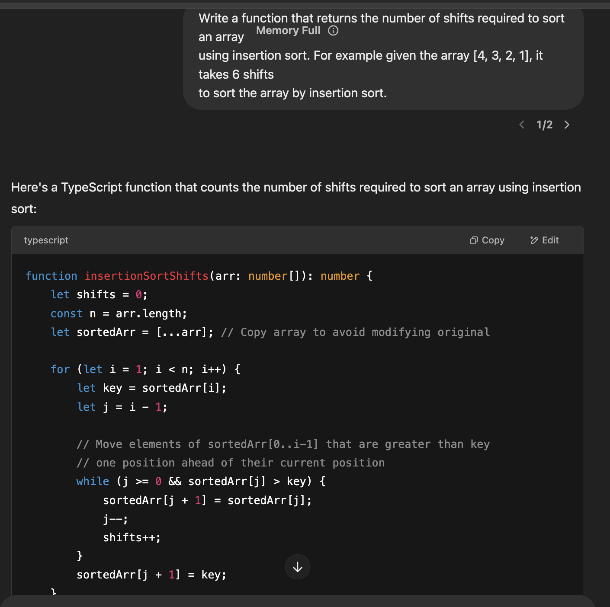

### Output

```python
def insertion_sort_shifts(arr):
    shifts = 0  # Initialize the shift counter
    for i in range(1, len(arr)):
        key = arr[i]  # Current element to be inserted
        j = i - 1
        # Move elements of arr[0..i-1] that are greater than key to one position ahead
        while j >= 0 and arr[j] > key:
            arr[j + 1] = arr[j]
            shifts += 1
            j -= 1
        arr[j + 1] = key
    return shifts
```

### Strength

Generates a quick solution that can handle small input list

### Weakness

Generates a non-optimized algorithm with complexity O(n^2) time,
that fails to handle very large list
my_list = list(reversed(range(200000)))
print(insertion_sort_shifts(my_list))
// Fails with ta timeout

### Screenshot


