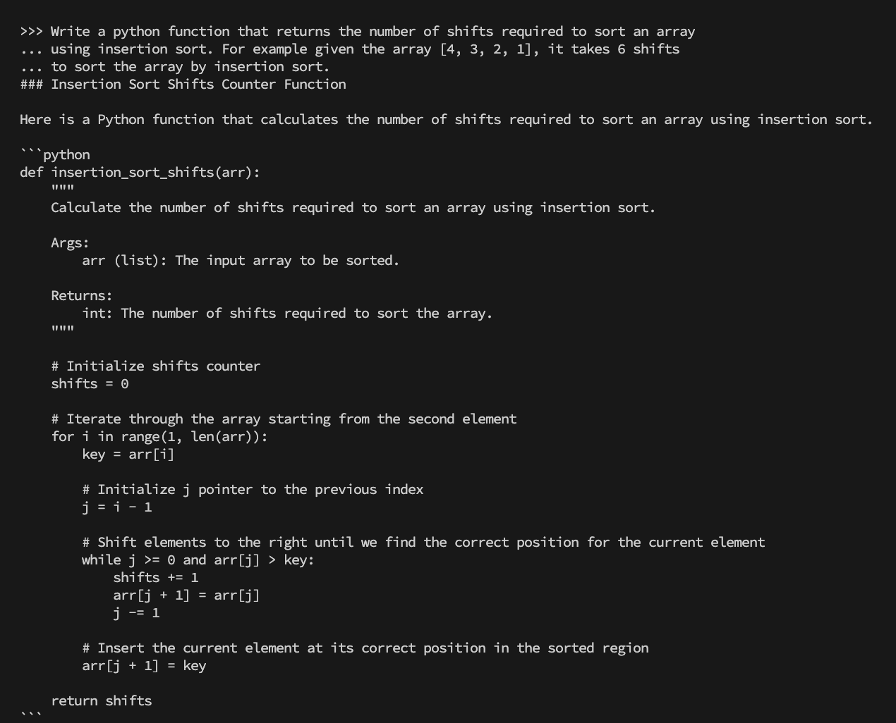

### Output

Here is a Python function that calculates the number of shifts required to sort an array using insertion sort.

```python
def insertion_sort_shifts(arr):
    """
    Calculate the number of shifts required to sort an array using insertion sort.

    Args:
        arr (list): The input array to be sorted.

    Returns:
        int: The number of shifts required to sort the array.
    """

    # Initialize shifts counter
    shifts = 0

    # Iterate through the array starting from the second element
    for i in range(1, len(arr)):
        key = arr[i]

        # Initialize j pointer to the previous index
        j = i - 1

        # Shift elements to the right until we find the correct position for the current element
        while j >= 0 and arr[j] > key:
            shifts += 1
            arr[j + 1] = arr[j]
            j -= 1

        # Insert the current element at its correct position in the sorted region
        arr[j + 1] = key

    return shifts
```

### Example Usage

```python
# Test the function with an example array
arr = [4, 3, 2, 1]
shifts_required = insertion_sort_shifts(arr)

print(f"The number of shifts required to sort the array {arr} is: {shifts_required}")
```

This will output:

```
The number of shifts required to sort the array [4, 3, 2, 1] is: 6
```

Note that this function counts each individual shift separately and returns the total number of shifts.

### Strength

Generates a quick solution that can handle small input list

### Weakness

The solution was not optimized. It had quadratic time complexity, and could not handle very large lists
my_list = list(reversed(range(200000)))
print(insertion_sort_shifts(my_list))
// Fails with a timeout

### Screenshot


