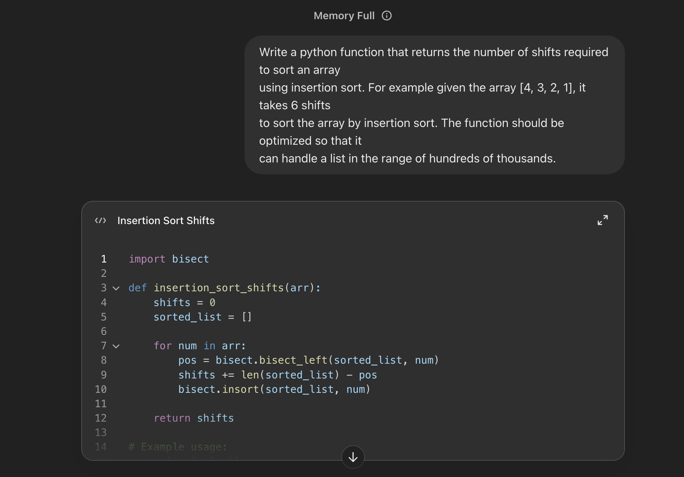

### Output

```python
import bisect

def insertion_sort_shifts(arr):
    shifts = 0
    sorted_list = []

    for num in arr:
        pos = bisect.bisect_left(sorted_list, num)
        shifts += len(sorted_list) - pos
        bisect.insort(sorted_list, num)

    return shifts
```

### Strength

The solution was concise and easy to understand

### Weakness

The output had two major drawbacks

1. It was buggy and gave the wrong output even for small input size
2. The model said the solution was linear time, but it had quadratic time complexity and timed out with large input size

### Screenshot


