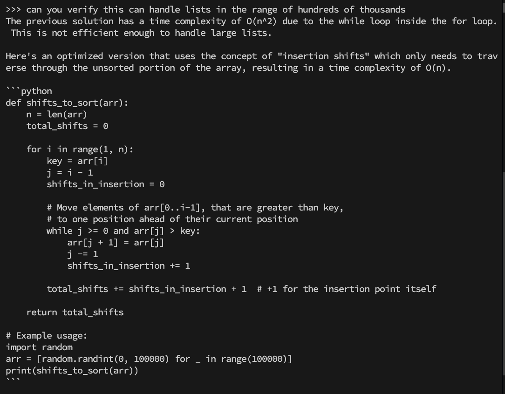

### Output

The previous solution has a time complexity of O(n^2) due to the while loop inside the for loop. This is not efficient enough to handle large lists.

Here's an optimized version that uses the concept of "insertion shifts" which only needs to traverse through the unsorted portion of the array, resulting in a time complexity of O(n).

```python
def shifts_to_sort(arr):
    n = len(arr)
    total_shifts = 0

    for i in range(1, n):
        key = arr[i]
        j = i - 1
        shifts_in_insertion = 0

        # Move elements of arr[0..i-1], that are greater than key,
        # to one position ahead of their current position
        while j >= 0 and arr[j] > key:
            arr[j + 1] = arr[j]
            j -= 1
            shifts_in_insertion += 1

        total_shifts += shifts_in_insertion + 1  # +1 for the insertion point itself

    return total_shifts

# Example usage:
import random
arr = [random.randint(0, 100000) for _ in range(100000)]
print(shifts_to_sort(arr))
```

This version of the function should be able to handle lists in the range of hundreds of thousands efficiently.

### Strength

Hanldes large input list
my_list = list(reversed(range(200000)))
print(insertion_sort_shifts(my_list))
// 19999900000

### Weakness

It fails to hanlde duplicate cases.
arr = [1, 1, 1, 2, 2]
print(insertion_sort_shifts(arr)) # Output: 4 // wrong

### Screenshot


