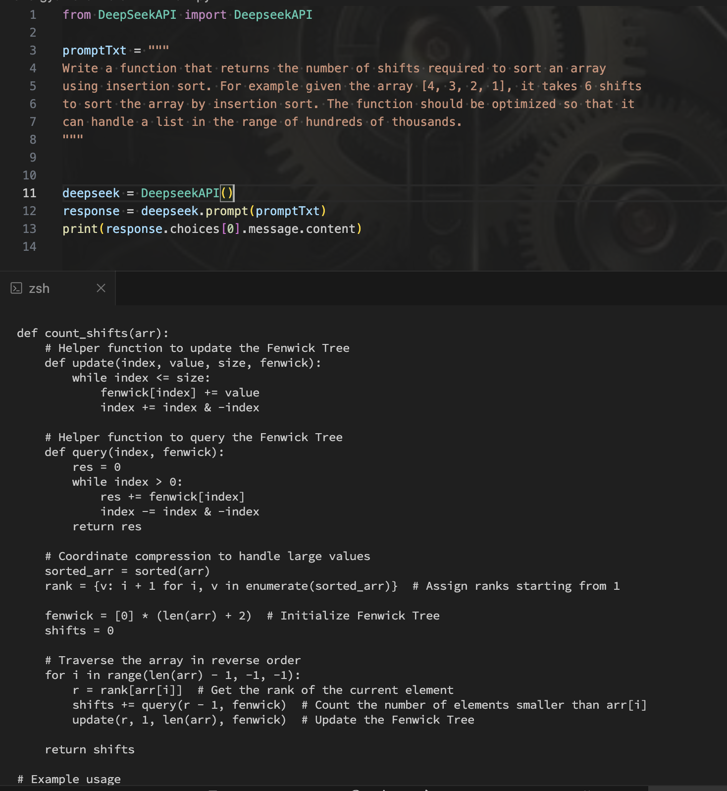

### Output

```python
def count_shifts(arr): # Helper function to update the Fenwick Tree
def update(index, value, size, fenwick):
while index <= size:
fenwick[index] += value
index += index & -index

    # Helper function to query the Fenwick Tree
    def query(index, fenwick):
        res = 0
        while index > 0:
            res += fenwick[index]
            index -= index & -index
        return res

    # Coordinate compression to handle large values
    sorted_arr = sorted(arr)
    rank = {v: i + 1 for i, v in enumerate(sorted_arr)}  # Assign ranks starting from 1

    fenwick = [0] * (len(arr) + 2)  # Initialize Fenwick Tree
    shifts = 0

    # Traverse the array in reverse order
    for i in range(len(arr) - 1, -1, -1):
        r = rank[arr[i]]  # Get the rank of the current element
        shifts += query(r - 1, fenwick)  # Count the number of elements smaller than arr[i]
        update(r, 1, len(arr), fenwick)  # Update the Fenwick Tree

    return shifts
```

### Strength

Generates an optimized algorithm capable of handling very large input lists.
my_list = list(reversed(range(200000)))
print(insertion_sort_shifts(my_list))
// 19999900000

### Weaknees

The solution a bit verbose

### Observation

With improved prompt, an optimized function is generated

### Screenshot


