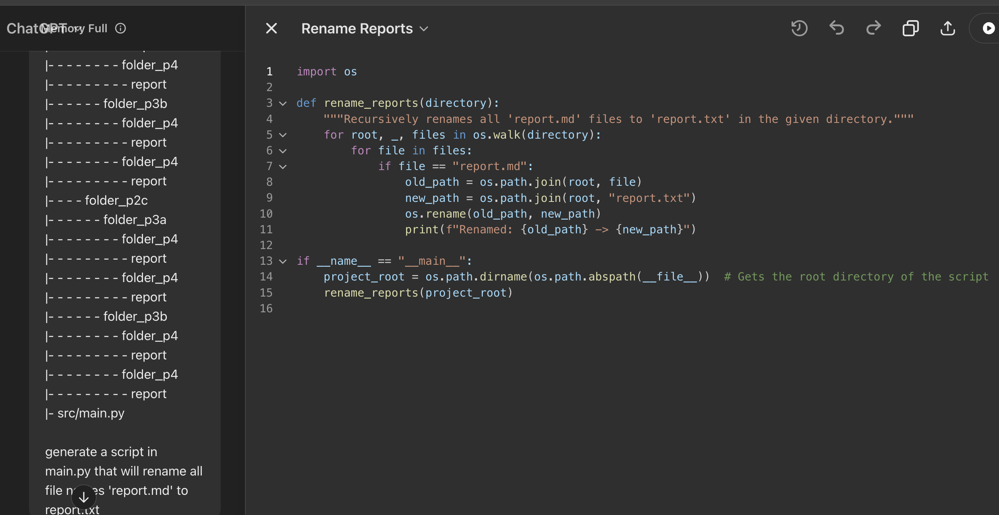

### Output

```python
import os

def rename_reports(directory):
    """Recursively renames all 'report.md' files to 'report.txt' in the given directory."""
    for root, _, files in os.walk(directory):
        for file in files:
            if file == "report.md":
                old_path = os.path.join(root, file)
                new_path = os.path.join(root, "report.txt")
                os.rename(old_path, new_path)
                print(f"Renamed: {old_path} -> {new_path}")

if __name__ == "__main__":
    project_root = os.path.dirname(os.path.abspath(__file__))  # Gets the root directory of the script
    rename_reports(project_root)
```

### STRENGTH

- Response was quick and generally in the right direction.
- It correctly implemented exception handling to catch any errors.

### WEAKNESS

- The solution did NOT work because it failed to correctly determine the project's root directly.
- Instead of going up two levels from \_\_file\_\_ based on the information in the prompt, it assumes that the target folders are located within the 'src' directly, as a result it didn't work.

### Screenshot


