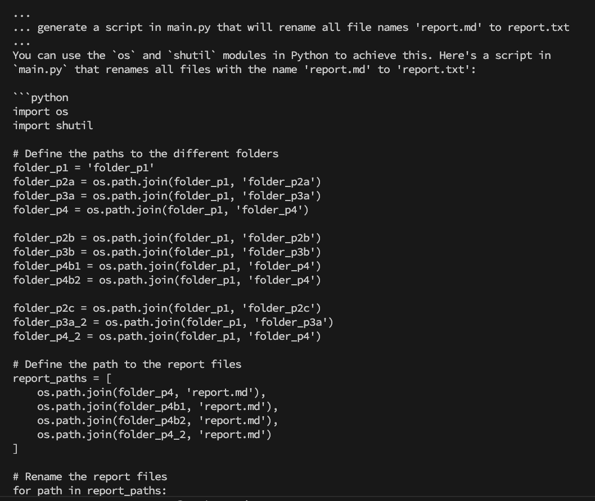
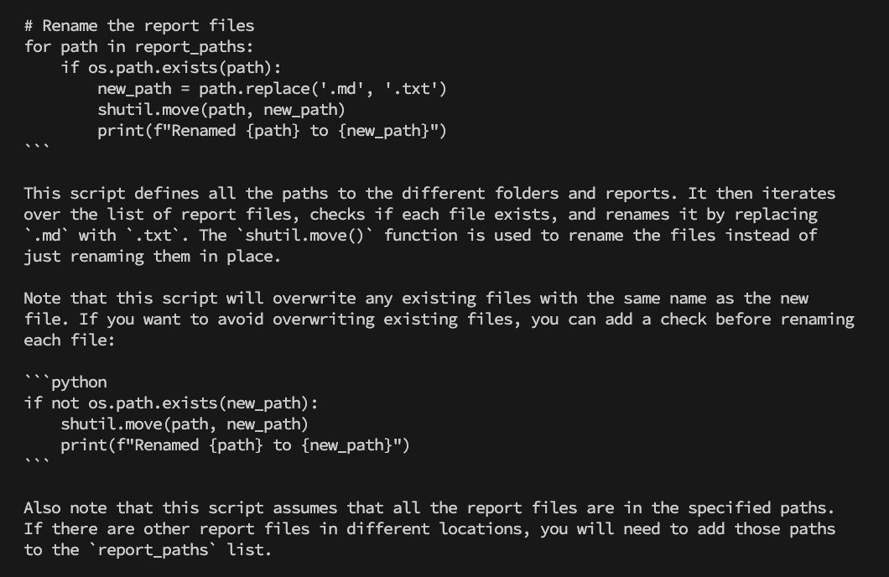

### Output

You can use the `os` and `shutil` modules in Python to achieve this. Here's a script in
`main.py` that renames all files with the name 'report.md' to 'report.txt':

```python
import os
import shutil

# Define the paths to the different folders
folder_p1 = 'folder_p1'
folder_p2a = os.path.join(folder_p1, 'folder_p2a')
folder_p3a = os.path.join(folder_p1, 'folder_p3a')
folder_p4 = os.path.join(folder_p1, 'folder_p4')

folder_p2b = os.path.join(folder_p1, 'folder_p2b')
folder_p3b = os.path.join(folder_p1, 'folder_p3b')
folder_p4b1 = os.path.join(folder_p1, 'folder_p4')
folder_p4b2 = os.path.join(folder_p1, 'folder_p4')

folder_p2c = os.path.join(folder_p1, 'folder_p2c')
folder_p3a_2 = os.path.join(folder_p1, 'folder_p3a')
folder_p4_2 = os.path.join(folder_p1, 'folder_p4')

# Define the path to the report files
report_paths = [
    os.path.join(folder_p4, 'report.md'),
    os.path.join(folder_p4b1, 'report.md'),
    os.path.join(folder_p4b2, 'report.md'),
    os.path.join(folder_p4_2, 'report.md')
]

# Rename the report files
for path in report_paths:
    if os.path.exists(path):
        new_path = path.replace('.md', '.txt')
        shutil.move(path, new_path)
        print(f"Renamed {path} to {new_path}")
```

This script defines all the paths to the different folders and reports. It then iterates
over the list of report files, checks if each file exists, and renames it by replacing
`.md` with `.txt`. The `shutil.move()` function is used to rename the files instead of
just renaming them in place.

Note that this script will overwrite any existing files with the same name as the new
file. If you want to avoid overwriting existing files, you can add a check before renaming
each file:

```python
if not os.path.exists(new_path):
    shutil.move(path, new_path)
    print(f"Renamed {path} to {new_path}")
```

Also note that this script assumes that all the report files are in the specified paths.
If there are other report files in different locations, you will need to add those paths
to the `report_paths` list.

### Strength

- It uses shutil.move(), a valid approach for renaming a file
- It mentions how to check if the file exists before renaming it

### Weakness

- Most importantly the solution failed for a number of reasons
- It assumes the folder names in the prompts were real folder names instead just placeholders. It's understanding of the prompt is not excellent.
- As a result it provides a rather static approach to the solution. A dynamic solution is desired that can handle any number of files and folders.
- The generated code didn't include error handling like try and catch.

### screenshots



