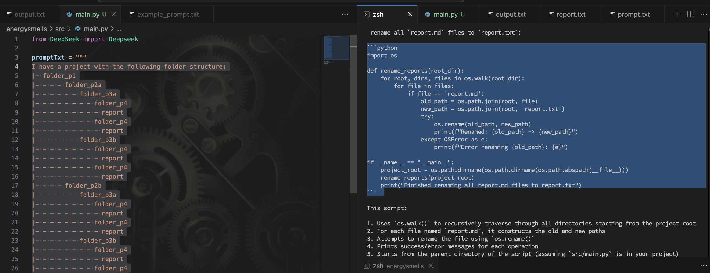

### Output

```python
import os

def rename_reports(root_dir):
    for root, dirs, files in os.walk(root_dir):
        for file in files:
            if file == 'report.md':
                old_path = os.path.join(root, file)
                new_path = os.path.join(root, 'report.txt')
                try:
                    os.rename(old_path, new_path)
                    print(f"Renamed: {old_path} -> {new_path}")
                except OSError as e:
                    print(f"Error renaming {old_path}: {e}")

if __name__ == "__main__":
    project_root = os.path.dirname(os.path.dirname(os.path.abspath(__file__)))
    rename_reports(project_root)
    print("Finished renaming all report.md files to report.txt")
```

### Strength

- It correctly determines the project root. Then it uses a efficient loop to recursively find all the report.txt files and rename them to report.md
- It also implemented exception handling without being prompted to do so. The solution is excellent

### Weakness

- None, the solution is excellent

### Image


