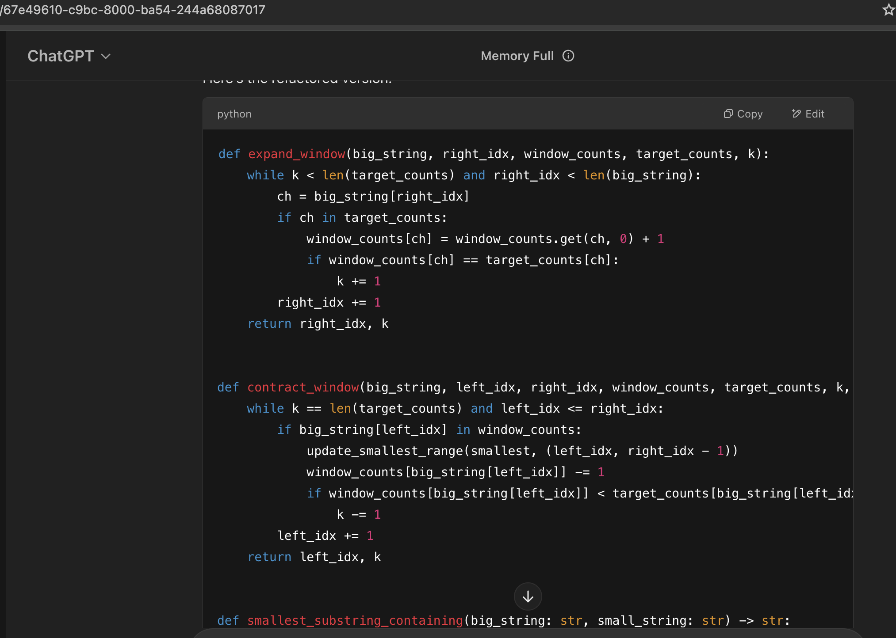

### Output

```python
def expand_window(big_string, right_idx, window_counts, target_counts, k):
    while k < len(target_counts) and right_idx < len(big_string):
        ch = big_string[right_idx]
        if ch in target_counts:
            window_counts[ch] = window_counts.get(ch, 0) + 1
            if window_counts[ch] == target_counts[ch]:
                k += 1
        right_idx += 1
    return right_idx, k


def contract_window(big_string, left_idx, right_idx, window_counts, target_counts, k, smallest):
    while k == len(target_counts) and left_idx <= right_idx:
        if big_string[left_idx] in window_counts:
            update_smallest_range(smallest, (left_idx, right_idx - 1))
            window_counts[big_string[left_idx]] -= 1
            if window_counts[big_string[left_idx]] < target_counts[big_string[left_idx]]:
                k -= 1
        left_idx += 1
    return left_idx, k


def smallest_substring_containing(big_string: str, small_string: str) -> str:
    target_counts, window_counts = string_to_hash(small_string), {}
    smallest, left_idx, right_idx, k = [-float("inf"), 0], 0, 0, 0

    while right_idx < len(big_string):
        right_idx, k = expand_window(big_string, right_idx, window_counts, target_counts, k)
        left_idx, k = contract_window(big_string, left_idx, right_idx, window_counts, target_counts, k, smallest)

    return big_string[smallest[0] : smallest[1] + 1] if smallest[0] >= 0 else ""
```

### Strengths

- Correclty refactors the algorithm, without any breaking changes.
- Kept all functions unler 10 lines of code

### Weaknesses

- Mssing comments, but the function names are quite descriptive

### Screenshot


