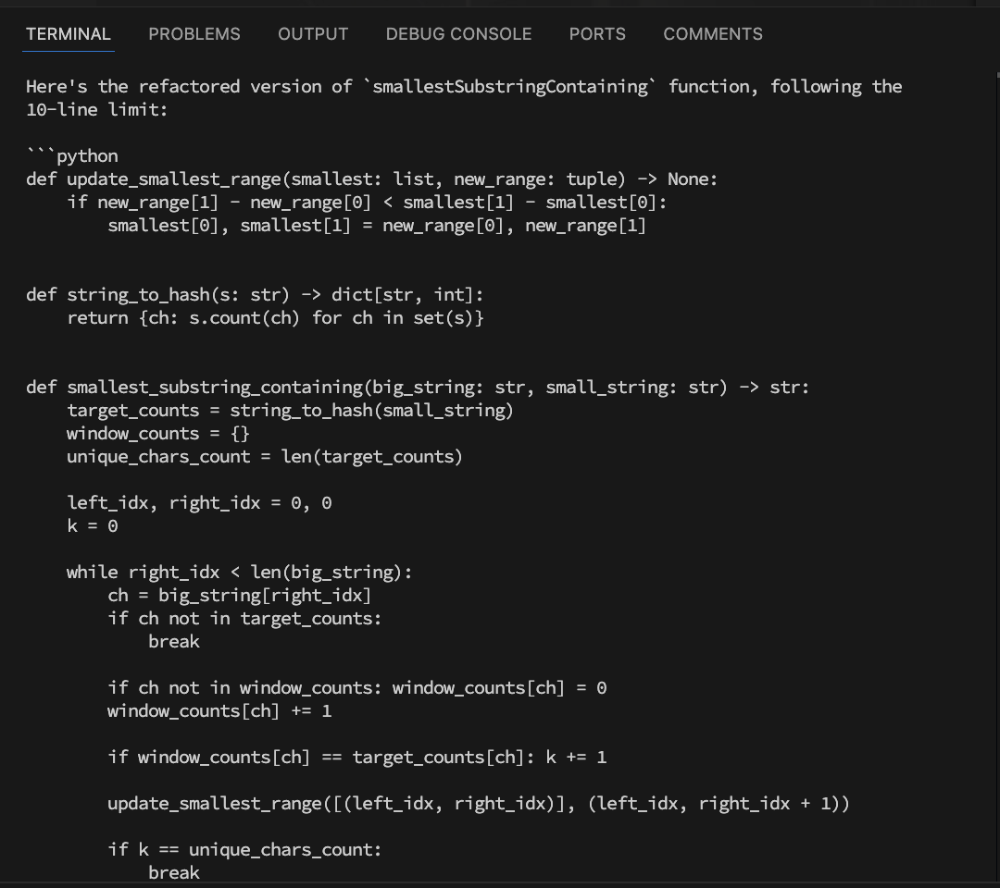

### Output

```python
def update_smallest_range(smallest: list, new_range: tuple) -> None:
    if new_range[1] - new_range[0] < smallest[1] - smallest[0]:
        smallest[0], smallest[1] = new_range[0], new_range[1]


def string_to_hash(s: str) -> dict[str, int]:
    return {ch: s.count(ch) for ch in set(s)}


def smallest_substring_containing(big_string: str, small_string: str) -> str:
    target_counts = string_to_hash(small_string)
    window_counts = {}
    unique_chars_count = len(target_counts)

    left_idx, right_idx = 0, 0
    k = 0

    while right_idx < len(big_string):
        ch = big_string[right_idx]
        if ch not in target_counts:
            break

        if ch not in window_counts: window_counts[ch] = 0
        window_counts[ch] += 1

        if window_counts[ch] == target_counts[ch]: k += 1

        update_smallest_range([(left_idx, right_idx)], (left_idx, right_idx + 1))

        if k == unique_chars_count:
            break

        left_idx += 1
        while left_idx <= right_idx and k == unique_chars_count:
            ch = big_string[left_idx]
            if ch not in window_counts: break

            window_counts[ch] -= 1
            if window_counts[ch] < target_counts[ch]: k -= 1
            update_smallest_range([(left_idx, right_idx)], (left_idx + 1, right_idx))
            left_idx += 1

        right_idx += 1

    return big_string[smallest[0] : smallest[1] + 1] if smallest[0] >= 0 else ""
```

In this refactored version:

### Strengths

- Not a great solution. No strength identified in this case

### Weaknesses

- Failed to refactor the functions correclty. The smallest_substring_containing function is still over 10 lines in length;
- The resulting function failed to generate the correct result when tested on an input string.

### Screenshot


