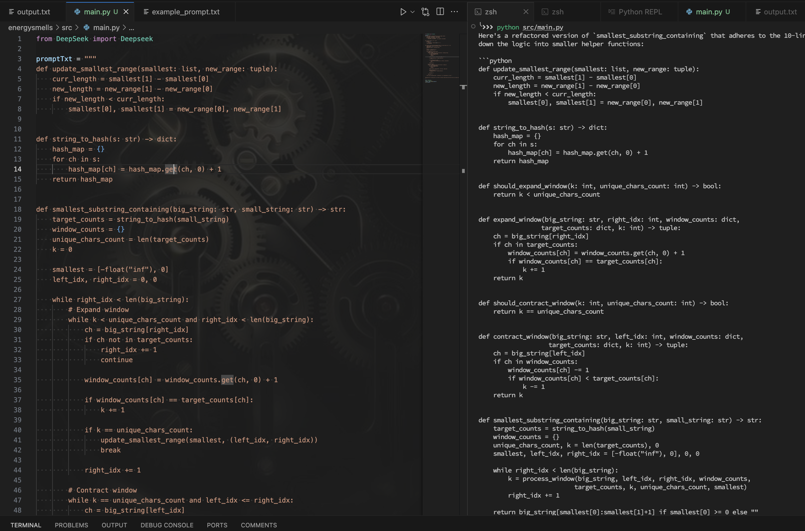

### Output

```python
def update_smallest_range(smallest: list, new_range: tuple):
    curr_length = smallest[1] - smallest[0]
    new_length = new_range[1] - new_range[0]
    if new_length < curr_length:
        smallest[0], smallest[1] = new_range[0], new_range[1]


def string_to_hash(s: str) -> dict:
    hash_map = {}
    for ch in s:
        hash_map[ch] = hash_map.get(ch, 0) + 1
    return hash_map


def should_expand_window(k: int, unique_chars_count: int) -> bool:
    return k < unique_chars_count


def expand_window(big_string: str, right_idx: int, window_counts: dict,
                 target_counts: dict, k: int) -> tuple:
    ch = big_string[right_idx]
    if ch in target_counts:
        window_counts[ch] = window_counts.get(ch, 0) + 1
        if window_counts[ch] == target_counts[ch]:
            k += 1
    return k


def should_contract_window(k: int, unique_chars_count: int) -> bool:
    return k == unique_chars_count


def contract_window(big_string: str, left_idx: int, window_counts: dict,
                   target_counts: dict, k: int) -> tuple:
    ch = big_string[left_idx]
    if ch in window_counts:
        window_counts[ch] -= 1
        if window_counts[ch] < target_counts[ch]:
            k -= 1
    return k


def smallest_substring_containing(big_string: str, small_string: str) -> str:
    target_counts = string_to_hash(small_string)
    window_counts = {}
    unique_chars_count, k = len(target_counts), 0
    smallest, left_idx, right_idx = [-float("inf"), 0], 0, 0

    while right_idx < len(big_string):
        k = process_window(big_string, left_idx, right_idx, window_counts,
                          target_counts, k, unique_chars_count, smallest)
        right_idx += 1

    return big_string[smallest[0]:smallest[1]+1] if smallest[0] >= 0 else ""


def process_window(big_string: str, left_idx: int, right_idx: int, window_counts: dict,
                 target_counts: dict, k: int, unique_chars_count: int, smallest: list) -> int:
    k = handle_window_expansion(big_string, right_idx, window_counts,
                              target_counts, k, unique_chars_count, smallest)
    k = handle_window_contraction(big_string, left_idx, window_counts,
                                 target_counts, k, unique_chars_count, smallest)
    return k


def handle_window_expansion(big_string: str, right_idx: int, window_counts: dict,
                          target_counts: dict, k: int, unique_chars_count: int, smallest: list) -> int:
    if should_expand_window(k, unique_chars_count) and right_idx < len(big_string):
        k = expand_window(big_string, right_idx, window_counts, target_counts, k)
        if k == unique_chars_count:
            update_smallest_range(smallest, (smallest[0], right_idx))
    return k


def handle_window_contraction(big_string: str, left_idx: int, window_counts: dict,
                            target_counts: dict, k: int, unique_chars_count: int, smallest: list) -> int:
    if should_contract_window(k, unique_chars_count) and left_idx <= right_idx:
        update_smallest_range(smallest, (left_idx, smallest[1]))
        k = contract_window(big_string, left_idx, window_counts, target_counts, k)
        left_idx += 1
    return k
```

### Strengths

- All refactored functions are within the 10-line limit

### Weaknesses

- Failed to return the correct output when tested with valid input. That is the algorithm was broken after refactoring.

### Screenshot


