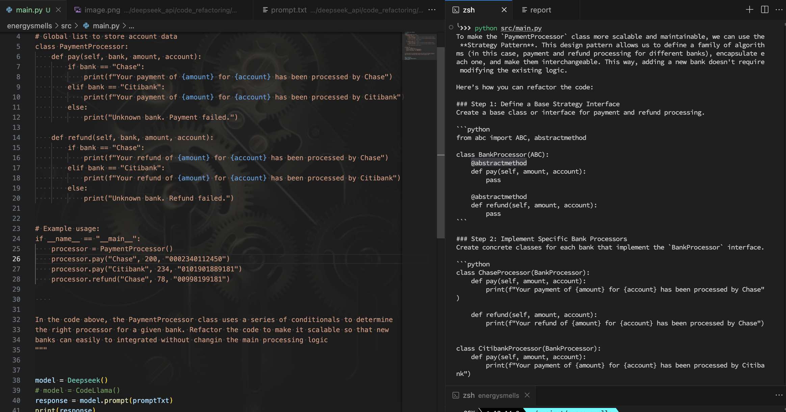

### Output

To make the `PaymentProcessor` class more scalable and maintainable, we can use the **Strategy Pattern**. This design pattern allows us to define a family of algorithms (in this case, payment and refund processing for different banks), encapsulate each one, and make them interchangeable. This way, adding a new bank doesn't require modifying the existing logic.

Here’s how you can refactor the code:

### Step 1: Define a Base Strategy Interface

Create a base class or interface for payment and refund processing.

```python
from abc import ABC, abstractmethod

class BankProcessor(ABC):
    @abstractmethod
    def pay(self, amount, account):
        pass

    @abstractmethod
    def refund(self, amount, account):
        pass
```

### Step 2: Implement Specific Bank Processors

Create concrete classes for each bank that implement the `BankProcessor` interface.

```python
class ChaseProcessor(BankProcessor):
    def pay(self, amount, account):
        print(f"Your payment of {amount} for {account} has been processed by Chase")

    def refund(self, amount, account):
        print(f"Your refund of {amount} for {account} has been processed by Chase")


class CitibankProcessor(BankProcessor):
    def pay(self, amount, account):
        print(f"Your payment of {amount} for {account} has been processed by Citibank")

    def refund(self, amount, account):
        print(f"Your refund of {amount} for {account} has been processed by Citibank")
```

### Step 3: Refactor the `PaymentProcessor` Class

Modify the `PaymentProcessor` class to use the strategy pattern. It will accept a `BankProcessor` object and delegate the payment and refund operations to it.

```python
class PaymentProcessor:
    def __init__(self, bank_processor: BankProcessor):
        self.bank_processor = bank_processor

    def pay(self, amount, account):
        self.bank_processor.pay(amount, account)

    def refund(self, amount, account):
        self.bank_processor.refund(amount, account)
```

### Step 4: Example Usage

Now, you can easily add new banks by creating new processor classes without modifying the `PaymentProcessor` class.

```python
if __name__ == "__main__":
    # Process payments with Chase
    chase_processor = PaymentProcessor(ChaseProcessor())
    chase_processor.pay(200, "0002340112450")
    chase_processor.refund(78, "00998199181")

    # Process payments with Citibank
    citibank_processor = PaymentProcessor(CitibankProcessor())
    citibank_processor.pay(234, "0101901889181")
    citibank_processor.refund(100, "0101901889181")
```

### Step 5: Adding a New Bank

To add a new bank, simply create a new processor class and use it with the `PaymentProcessor`.

```python
class WellsFargoProcessor(BankProcessor):
    def pay(self, amount, account):
        print(f"Your payment of {amount} for {account} has been processed by Wells Fargo")

    def refund(self, amount, account):
        print(f"Your refund of {amount} for {account} has been processed by Wells Fargo")


# Example usage for Wells Fargo
wells_fargo_processor = PaymentProcessor(WellsFargoProcessor())
wells_fargo_processor.pay(500, "1234567890")
wells_fargo_processor.refund(150, "1234567890")
```

### Benefits of This Approach

1. **Scalability**: Adding a new bank requires only creating a new processor class, without modifying existing code.
2. **Maintainability**: The logic for each bank is encapsulated in its own class, making the code easier to understand and maintain.
3. **Flexibility**: You can dynamically switch between different bank processors at runtime.

This refactoring adheres to the **Open/Closed Principle** (open for extension, closed for modification) and makes the system more robust and scalable.

### Strength

The solution is solid, correclty using the ABC module in creating an abstract (BankProcessor) that forces all concrete processors to the pay and refund methods

### Weakness

Not much weaknes was identified. The solution is a descent implementation of Strategy design pattern.

### Screenshot


