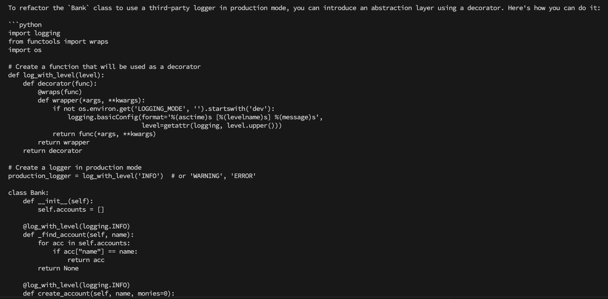
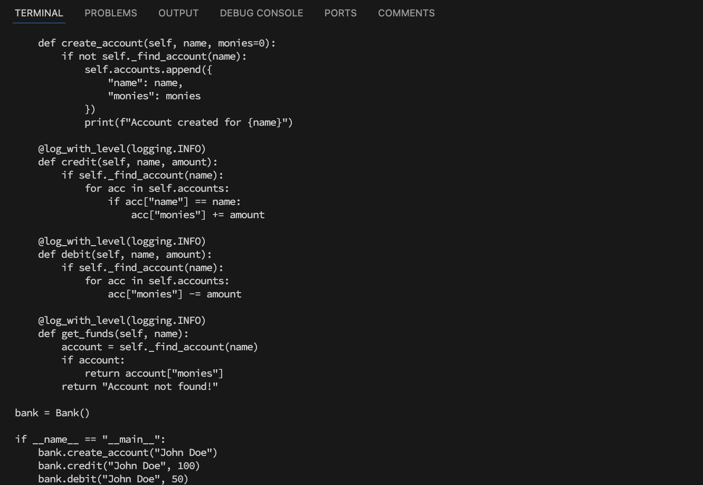

### Output

To refactor the `Bank` class to use a third-party logger in production mode, you can introduce an abstraction layer using a decorator. Here's how you can do it:

```python
import logging
from functools import wraps
import os

# Create a function that will be used as a decorator
def log_with_level(level):
    def decorator(func):
        @wraps(func)
        def wrapper(*args, **kwargs):
            if not os.environ.get('LOGGING_MODE', '').startswith('dev'):
                logging.basicConfig(format='%(asctime)s [%(levelname)s] %(message)s',
                                    level=getattr(logging, level.upper()))
            return func(*args, **kwargs)
        return wrapper
    return decorator

# Create a logger in production mode
production_logger = log_with_level('INFO')  # or 'WARNING', 'ERROR'

class Bank:
    def __init__(self):
        self.accounts = []

    @log_with_level(logging.INFO)
    def _find_account(self, name):
        for acc in self.accounts:
            if acc["name"] == name:
                return acc
        return None

    @log_with_level(logging.INFO)
    def create_account(self, name, monies=0):
        if not self._find_account(name):
            self.accounts.append({
                "name": name,
                "monies": monies
            })
            print(f"Account created for {name}")

    @log_with_level(logging.INFO)
    def credit(self, name, amount):
        if self._find_account(name):
            for acc in self.accounts:
                if acc["name"] == name:
                    acc["monies"] += amount

    @log_with_level(logging.INFO)
    def debit(self, name, amount):
        if self._find_account(name):
            for acc in self.accounts:
                acc["monies"] -= amount

    @log_with_level(logging.INFO)
    def get_funds(self, name):
        account = self._find_account(name)
        if account:
            return account["monies"]
        return "Account not found!"

bank = Bank()

if __name__ == "__main__":
    bank.create_account("John Doe")
    bank.credit("John Doe", 100)
    bank.debit("John Doe", 50)
    funds = bank.get_funds("John Doe")
    print("John Doe's funds:", funds)

# To enable the production logger in a test environment, you can add an environment variable
os.environ['LOGGING_MODE'] = 'dev'

# Example usage with dev logging:
bank.create_account("Test Account")  # INFO level will be used
```

In this code:

1. We create a decorator `log_with_level` that takes a logging level as input and logs the output of the decorated function to the console at the specified level.

2. In production mode, we set up the logger with a basic configuration in the `production_logger`.

3. We apply this decorator to all methods of the `Bank` class using the `@log_with_level` syntax.

4. To switch between dev and prod logging modes, you can modify an environment variable named `LOGGING_MODE`. When the value starts with 'dev', the logger will use debug levels; otherwise, it will use
   info level.

### Strength

It uses decorator to switch between development and production log.
The use of decorators is nice because it avoids code repeatition.

### Weakness

However the proposed solution is not efficient for the following reasons:

- the aim was to be able to switch between different loggers like winston, morgan, pino, Log4js, etc. Instead the proposed solution offers only two options - dev and prod config.
- It also continues to use print to log data

### Screenshot



