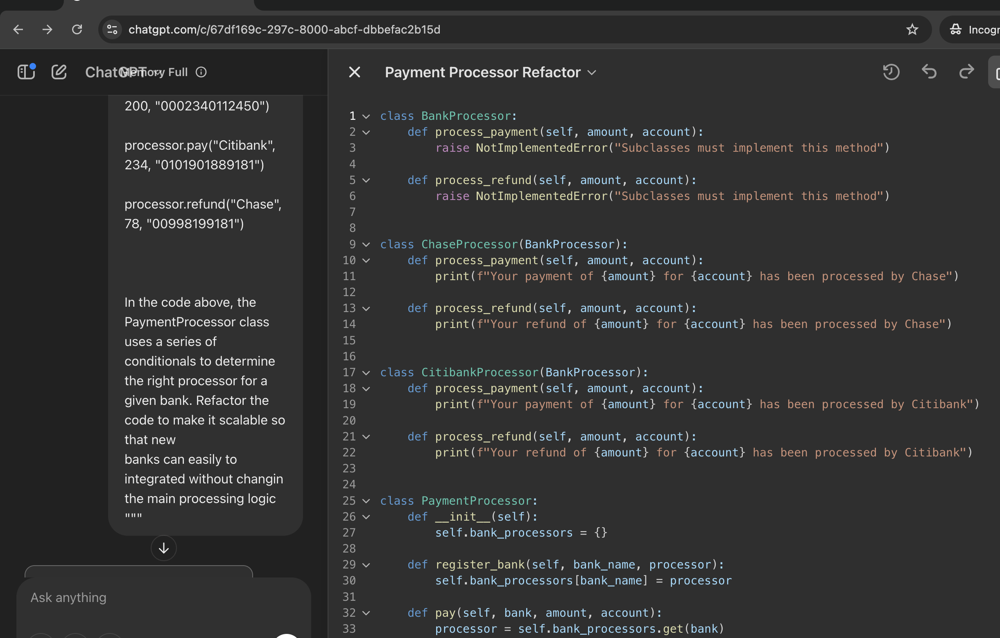

### Output

```python
class BankProcessor:
    def process_payment(self, amount, account):
        raise NotImplementedError("Subclasses must implement this method")

    def process_refund(self, amount, account):
        raise NotImplementedError("Subclasses must implement this method")


class ChaseProcessor(BankProcessor):
    def process_payment(self, amount, account):
        print(f"Your payment of {amount} for {account} has been processed by Chase")

    def process_refund(self, amount, account):
        print(f"Your refund of {amount} for {account} has been processed by Chase")


class CitibankProcessor(BankProcessor):
    def process_payment(self, amount, account):
        print(f"Your payment of {amount} for {account} has been processed by Citibank")

    def process_refund(self, amount, account):
        print(f"Your refund of {amount} for {account} has been processed by Citibank")


class PaymentProcessor:
    def __init__(self):
        self.bank_processors = {}

    def register_bank(self, bank_name, processor):
        self.bank_processors[bank_name] = processor

    def pay(self, bank, amount, account):
        processor = self.bank_processors.get(bank)
        if processor:
            processor.process_payment(amount, account)
        else:
            print("Unknown bank. Payment failed.")

    def refund(self, bank, amount, account):
        processor = self.bank_processors.get(bank)
        if processor:
            processor.process_refund(amount, account)
        else:
            print("Unknown bank. Refund failed.")


# Example usage:
if __name__ == "__main__":
    processor = PaymentProcessor()
    processor.register_bank("Chase", ChaseProcessor())
    processor.register_bank("Citibank", CitibankProcessor())

    processor.pay("Chase", 200, "0002340112450")
    processor.pay("Citibank", 234, "0101901889181")
    processor.refund("Chase", 78, "00998199181")
```

### Strength

The solution is not quite a typicial Strategy design pattern, but it's
a good alternative to it. It uses a 'register_bank' method to create
to set the payment processing strategy according to the registered bank.

### Weakness

Apart from the use of plane string in the the register_bank method which can result in a typo error, it seems a pretty descent solution.

### Screenshot


