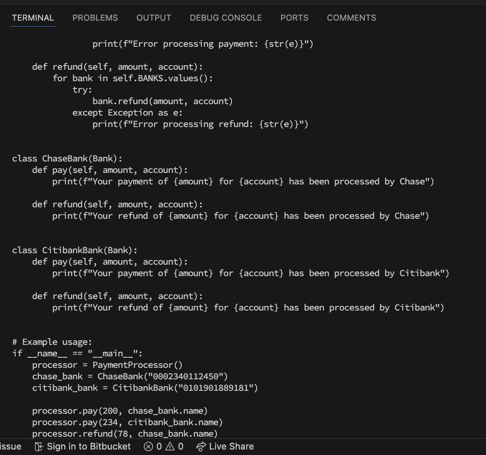

### Output

```python
# Global list to store account data
class Bank:
    def __init__(self, name):
        self.name = name

class PaymentProcessor:
    BANKS = {
        "Chase": ChaseBank,
        "Citibank": CitibankBank
    }

    def __init__(self):
        pass

    @classmethod
    def get_bank(cls, bank_name):
        if bank_name in cls.BANKS:
            return cls.BANKS[bank_name]()
        else:
            raise ValueError(f"Unknown bank: {bank_name}")

    def pay(self, amount, account):
        for bank in self.BANKS.values():
            try:
                bank.pay(amount, account)
            except Exception as e:
                print(f"Error processing payment: {str(e)}")

    def refund(self, amount, account):
        for bank in self.BANKS.values():
            try:
                bank.refund(amount, account)
            except Exception as e:
                print(f"Error processing refund: {str(e)}")


class ChaseBank(Bank):
    def pay(self, amount, account):
        print(f"Your payment of {amount} for {account} has been processed by Chase")

    def refund(self, amount, account):
        print(f"Your refund of {amount} for {account} has been processed by Chase")


class CitibankBank(Bank):
    def pay(self, amount, account):
        print(f"Your payment of {amount} for {account} has been processed by Citibank")

    def refund(self, amount, account):
        print(f"Your refund of {amount} for {account} has been processed by Citibank")


# Example usage:
if __name__ == "__main__":
    processor = PaymentProcessor()
    chase_bank = ChaseBank("0002340112450")
    citibank_bank = CitibankBank("0101901889181")

    processor.pay(200, chase_bank.name)
    processor.pay(234, citibank_bank.name)
    processor.refund(78, chase_bank.name)

```

### Strength

It creates the right classes needed for the refactoring, but the method implementations are not great.

### Weakness

The provided solution has some weak points

- It fails to make proper use of inheritance and method override to implement a good strategy for the payment processor.
- It employs a method that iterates through every bank and attempts to call the pay or refund method on it. Which is both inefficient and confusing.

### Screenshot



